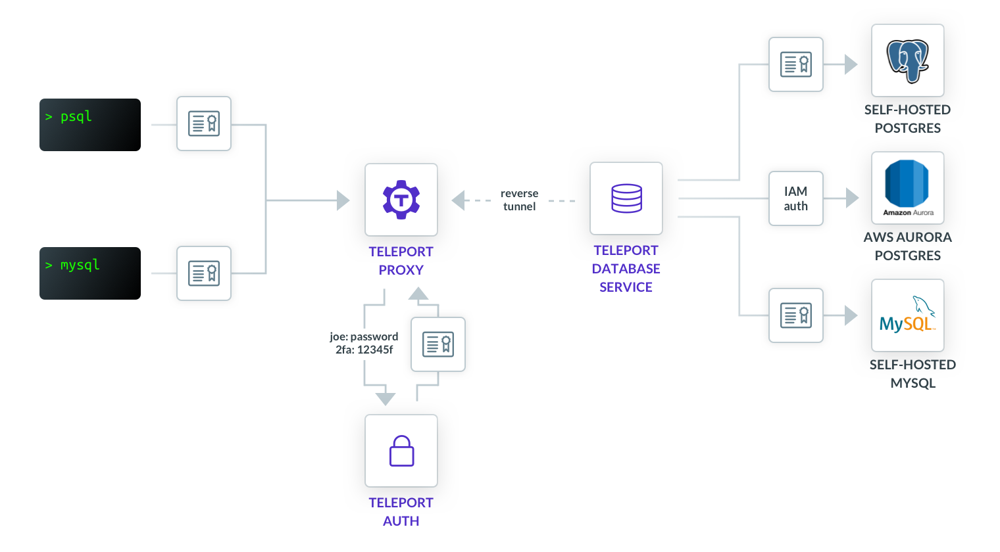

# Database Access Architecture

This section provides on overview of Teleport Database Access inner workings.

See [Architecture Overview](../architecture/overview.md) for general Teleport
architecture principles.

## How It Works

The following diagram shows an example Database Access deployment:

In it, we have the following Teleport components:

* [Teleport Proxy](../architecture/proxy.md). It's a stateless service
  that performs a function of an authentication gateway, serves web UI and
  accepts database (and other) client connections.
* [Teleport Auth](../architecture/authentication.md). It serves as
  cluster's certificate authority, handles user authentication/authorization
  and issues short-lived client certificates.
* Teleport Database Service. It's the Database Access' "brain" that connects
  to the databases, performs database authentication and protocol parsing.

To connect back to the cluster, Database Service establishes an SSH reverse
tunnel to the Proxy.

As such, users do not need to have direct connectivity to the Database Service,
or the databases it's connected to. As long as it can dial back to the cluster's
Proxy server, it can be located behind a firewall.

!!! tip

    You can have multiple Database Services connected to the cluster, and each
    Database Service can be connected to multiple databases.

Let's take a look at the typical flow Database Access users go through to
connect to a database.

1. First, a user logs into the cluster with `tsh login` command and retrieves
   a client certificate. See [Issuing User Certificates](../architecture/authentication.md#issuing-user-certificates)
   for more details on how it works.
2. Once logged in, the user picks the database the want to connect to from
   the list of available databases shown in `tsh db ls` command and retrieves
   a short-lived certificate for it with `tsh db login`.
3. The user uses a standard database client (e.g. `psql`, `mysql` or one of
   [graphical clients](./gui-clients.md)) to connect to the Proxy, authenticating
   with the client certificate from step 2.
4. The Proxy authenticates the connection and dispatches it to the appropriate
   Database Service based on the routing information encoded in the client
   certificate, over the reverse tunnel.
5. The Database Service also authenticates the connection, does an authorization
   check to make sure the user has access to the database they's connecting to
   and establishes the connection to the database.
6. Connection has been established, the Database Service starts proxying traffic
   between the user's database client and the database and interpreting the
   database wire protocol messages to submit events to the audit log.

## Authentication

Teleport relies on short-lived client certificates as the primary means of
authentication, both for user authentication as well as authentication between
internal components.

In the Database Access architecture, authentication happens in 3 places:
database client to Proxy, Proxy to Database Service, and Database Service to
database. Let's take a look in more detail at each one.

### Database Client <-> Proxy

Database clients authenticate with the Proxy using x509 client certificates
obtained from `tsh db login` command.

The login command updates database-specific local configuration files (e.g.
PostgreSQL [connection service file](https://www.postgresql.org/docs/13/libpq-pgservice.html)
or MySQL [option file](https://dev.mysql.com/doc/refman/8.0/en/option-files.html)
to group connection information for a particular database together which CLI
clients can refer to.

For configuring graphical clients, there is a `tsh db config` command that
prints detailed information about the connection such as host/port and location
of the secrets. See [GUI Clients](./gui-clients.md) for details.

### Proxy <-> Database Service

The connection between the Proxy and the Database Service is also authenticated
with mutual TLS.

The Proxy generates an ephemeral short-lived x509 certificate signed by the
cluster's host authority, with the client's identity and database routing
information encoded in it, and uses it to authenticate with the Database Service.

### Database Service <-> Database

Database authentication is handled differently for self-hosted databases and
databases hosted by AWS.

#### Self-Hosted

Teleport Database Service uses client certificate authentication with self-hosted
database servers.

See respective configuration guides for [PostgreSQL](./postgres-self-hosted.md)
and [MySQL](./mysql-self-hosted.md) for details on configuring client certificate
authentication.

#### AWS RDS / Aurora

To RDS and Aurora database instances the Database Service authenticates using
[IAM Authentication](https://docs.aws.amazon.com/AmazonRDS/latest/UserGuide/UsingWithRDS.IAMDBAuth.html).

The Database Service automatically generates an IAM token for each connection
which is used as a password.

See respective configuration guides for [PostgreSQL](./postgres-aws.md) and
[MySQL](./mysql-aws.md) for details on configuring IAM authentication.

## RFD

Please refer to the [RFD document](https://github.com/gravitational/teleport/blob/024fd582e62560ffc925cd4b4d42c156043c041b/rfd/0011-database-access.md)
for a more in-depth description of the feature scope and design.
